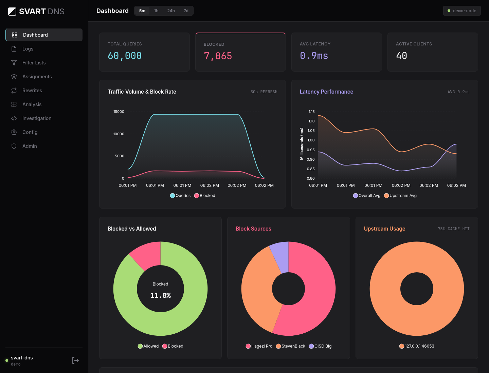

# Svart DNS

Svart is a self-hosted DNS sinkhole for people who want to understand and tune
what their network blocks. It combines DNS filtering, per-device policy,
filter-list comparison, and query-history investigation in one Go process with
an embedded web UI. It forwards allowed queries to your chosen upstream
resolvers; it does not perform recursive resolution itself.



*Actual Svart UI with synthetic demo traffic. These values illustrate the UI,
not benchmark results.*

## What it does

- **Filter Lists** manages blocklists and allowlists, automatic refreshes, and
  refresh history. Hosts files, domain lists, wildcards, and a subset of
  AdGuard/Adblock syntax are supported; see [Known limitations](#known-limitations).
- **Assignments** applies lists and custom rules to IP ranges, groups, and
  individual client IPs. A device-specific decision overrides a group decision,
  which overrides a range decision.
- **Analysis** compares lists against observed traffic and simulates policy
  changes before you apply them.
- **Logs and Investigation** explain filtering decisions and provide admin-only,
  read-only SQL over recent SQLite logs and older Parquet archives using DuckDB.
- **Rewrites** maps local names to IP addresses through the UI or API.
- **Upstream routing** supports UDP, TCP, DNS-over-TLS (DoT), and DNS-over-HTTPS
  (DoH), with weighted, random, or blended selection and domain-specific routes.
- **Operations** includes configuration sync between nodes, API tokens,
  Prometheus metrics, optional Loki log export, and local configuration backup
  and restore.

Clients connect to Svart over **plain DNS on UDP or TCP**. DoH and DoT support
is for outgoing queries to upstream resolvers. HTTPS on the admin UI does not
create a DoH listener.

## Quick start

From a checkout of this repository, on a machine with Docker Engine and Compose
v2 installed:

```bash
docker compose up -d --build
docker compose logs svart
```

Find the `first-run setup` log entry, then open `http://<host-address>:3000`.
Paste the one-time token to create your administrator account. The setup wizard
then configures upstreams and filter lists; its initial choices are a
Quad9/Mullvad/Cloudflare DoH mix and Hagezi Pro. Review those choices for your
network. Until upstreams are configured, the built-in resolver is Quad9 DoH.

The supplied [compose.yaml](compose.yaml) builds the image locally, publishes
DNS on host port **53/UDP and 53/TCP**, and publishes the UI on **3000/TCP**.
Those ports must be available. Named volumes preserve the database and archives
across container replacement. Set `EXTERNAL_IP` in the Compose environment to
the host's LAN address if you want the setup page to show it.

Test a query from a permitted client, replacing the address below with your
server's address:

```bash
dig @<host-address> example.com
dig +tcp @<host-address> example.com
```

Then configure your router's DHCP DNS setting, or an individual device, to use
that address. Svart does not provide DHCP. For consistent filtering, every DNS
server advertised to clients should apply your intended policy. The default
DNS access list permits loopback, private, CGNAT, link-local, and IPv6 ULA
addresses; configure `ALLOWED_CLIENTS` for other networks.

For source builds, prerequisites, TLS, and development commands, see
[Getting started](docs/getting-started.md), [Configuration](docs/configuration.md),
and [Operations](docs/operations.md). The running server serves its API reference
at `/docs` and its OpenAPI document at `/docs/swagger.json`.

## How it compares

Svart grew from the author's use of Pi-hole and AdGuard Home. Its focus is the
combination of traffic-based list comparison, a range/group/client policy
cascade, and SQL investigation across recent and archived history. These are
design priorities, not a claim that other projects lack analytics or APIs.

| Project | Capabilities to consider alongside Svart |
|---|---|
| **Pi-hole** | DNS filtering with a dashboard, optional DHCP, client/group list assignments, and a documented REST API. See its [overview](https://docs.pi-hole.net/), [group examples](https://docs.pi-hole.net/group_management/example/), and [API documentation](https://docs.pi-hole.net/api/). |
| **AdGuard Home** | DNS filtering with per-client settings, built-in DHCP, encrypted upstreams, and client-facing DoH/DoT servers. Its broader filtering syntax includes record-type modifiers and regular expressions that Svart does not fully implement. See its [official feature overview](https://github.com/AdguardTeam/AdGuardHome) and [DNS filtering syntax](https://adguard-dns.io/kb/general/dns-filtering-syntax/). |
| **Technitium DNS Server** | Authoritative and recursive DNS, DNSSEC validation, zone management, DHCP, encrypted DNS listeners/forwarders, clustering, and an HTTP API. It also offers per-client advanced blocking through a DNS App. See its [official feature list](https://technitium.com/dns/). |
| **Svart** | A forwarding DNS sinkhole with the analysis and policy workflow above. No DHCP, authoritative zone service, recursive resolver, or client-facing DoH/DoT listener. |

Comparison sources checked September 26, 2026. For reproducible performance
measurements, workload definitions, and limitations, see
[Benchmarks](docs/benchmarks.md). Performance depends on list contents, cache
state, logging, hardware, and the workload; historical numbers are not a claim
about the current release. The final backend measurements show millisecond
manual edits with three million rules, alongside lower logged DNS throughput
and higher tail latency after backlog. That large-list run exceeded 1 GiB process
RSS; see [memory sizing and ARM limitations](docs/operations.md#resource-use).

## Known limitations

DNS filtering sees names, not the contents of a web page. It cannot distinguish
an advertisement from wanted content on the same hostname. Svart only observes
queries sent to it: a device using another resolver bypasses its filtering and
query history. Clients behind the same source IP share that identity.

Svart supports DNS-oriented AdGuard syntax, including Go-compatible regexes,
record-type restrictions, rule-local exclusions and list-local priorities.
Unsupported restrictions skip the whole rule, including negative client/tag
restrictions. Filter Lists shows applied, unsupported and invalid counts with
complete paginated reasons. A malformed supported regex that fails compilation
rejects the refresh and keeps the previous generation.

| Not supported | Consequence | Example |
|---|---|---|
| Regex features outside Go's syntax, such as backreferences or lookaround | A recognized regex that cannot compile rejects the refresh. | `/^(ads)\1\.example$/` cannot compile; use an equivalent Go-compatible expression. |
| Rules limited to clients or tags (`$client`, `$ctag`), including exclusions | The whole rule is skipped. Use Svart's Assignments for different device policies. | `\|\|example.com^$client=~192.168.1.10` is not applied to anyone. |
| Address ranges (`://46.148.113.`) | Returned addresses in that range are not blocked by the range rule. Exact address entries are supported. | `46.148.113.9` can match a returned address. |
| Browser-only rules (`$third-party`, `$script`, `$domain=`, `$popup`, element hiding `##`) | These browser contexts and page elements cannot be enforced by Svart's DNS filter. | Use a browser content blocker for page-level rules. |
| Wildcards in `$denyallow` values | The complete rule is rejected; exclusions currently accept domain names and their subdomains. | `$denyallow=example.*` does not become an unrestricted block. |
| `$dnsrewrite` in a list | The list's rewrite is not applied. | Configure local name-to-IP mappings in Rewrites. |

Supported syntax also has deliberate differences from
[AdGuard's rule model](https://adguard-dns.io/kb/general/dns-filtering-syntax/):

- **Plain domains and hosts entries match subdomains**, preserving Svart's
  existing list behavior. Explicit `|example.com|` matches only that name.
- **`@@` exceptions and `$badfilter` cancellation are list-local.** Another
  assigned list can still block the name. Cancellation compares the full rule,
  excluding only the `$badfilter` modifier.
- **`$important` changes priority inside its list.** Important exceptions beat
  important blocks, which beat ordinary exceptions and blocks. Svart's existing
  Assignment precedence and explicit allows still apply afterwards.
- **The existing bare `*` rule remains supported.** It matches every name; AdGuard rejects an unrestricted rule this broad.
- **Regex matching uses Go's regular-expression syntax.** Patterns compile
  during refresh and snapshot construction, never during a DNS lookup.

[List syntax](docs/configuration.md#list-syntax) documents the supported forms.
Query logging coalesces high-rate client/domain loops into counted presentation
rows. The durable journal and separate [raw archives](docs/raw-archives.md)
retain the original events, including individual timestamps and latency, until
configured retention expires them. DNS replies remain asynchronous: an abrupt
crash can lose the newest events still in memory. See
[logging durability](docs/logging-durability.md) for that boundary.

## Documentation and contributing

- [Overview](docs/overview.md) — purpose and common workflows
- [Architecture](docs/architecture.md) — request paths and storage
- [Code layout](docs/code-layout.md) — where to find each subsystem
- [Getting started](docs/getting-started.md) — build and development setup
- [Configuration](docs/configuration.md) and [Operations](docs/operations.md)
- [Design decisions](docs/decisions/README.md) and [Roadmap](docs/roadmap.md)
- [Contributing](CONTRIBUTING.md) and [Security policy](SECURITY.md)

Run `make verify` for formatting, strict lint/type checks, generated API
consistency, Go tests and race detection, all four language coverage gates,
public-export checks, dependency vulnerability checks, and frontend license
checks. Each owned production language must meet at least 80% coverage; the
frontend also gates branches and functions. Run `make e2e` for the isolated
browser, two-node DNS, backup/restart, and archive-ownership checks. CI runs both
against the exact event commit. See [Contributing](CONTRIBUTING.md) for tool
prerequisites and [the E2E guide](scripts/e2e/README.md) for its precise scope.

## License and name

Svart is [MIT licensed](LICENSE); dependencies retain their own licenses, listed
in [Third-party notices](THIRD_PARTY_NOTICES.md). *Svart* means black in Swedish.
