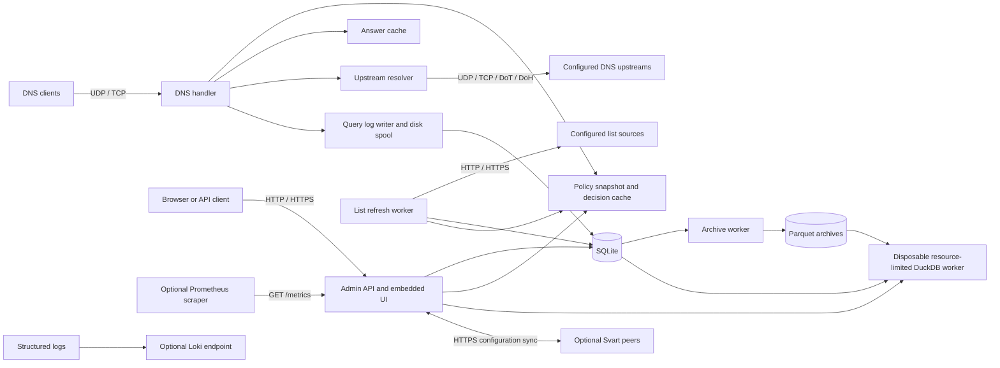
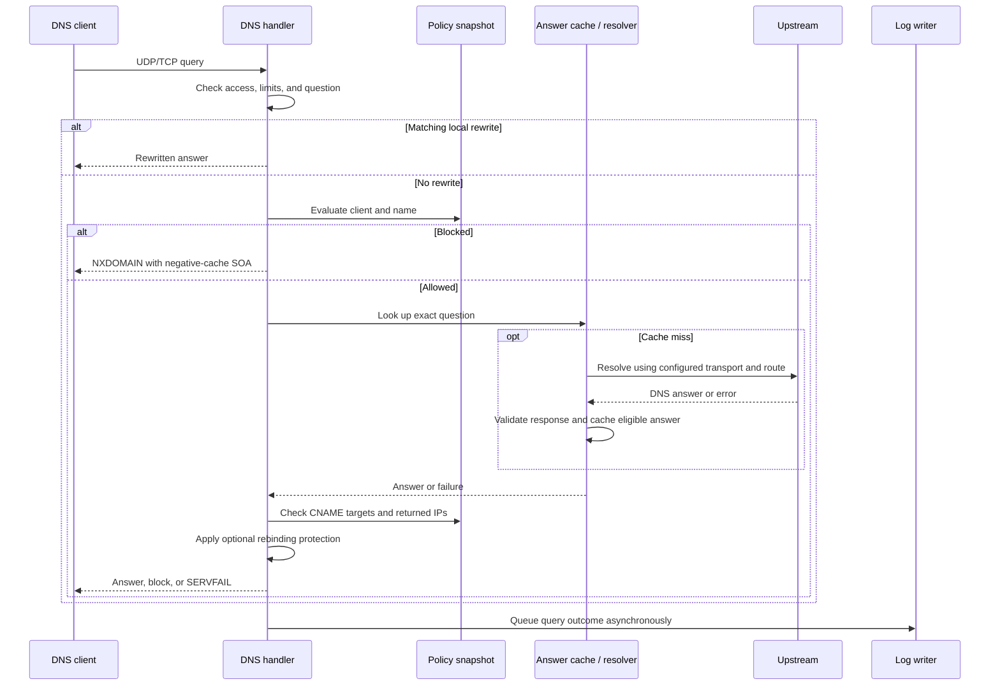
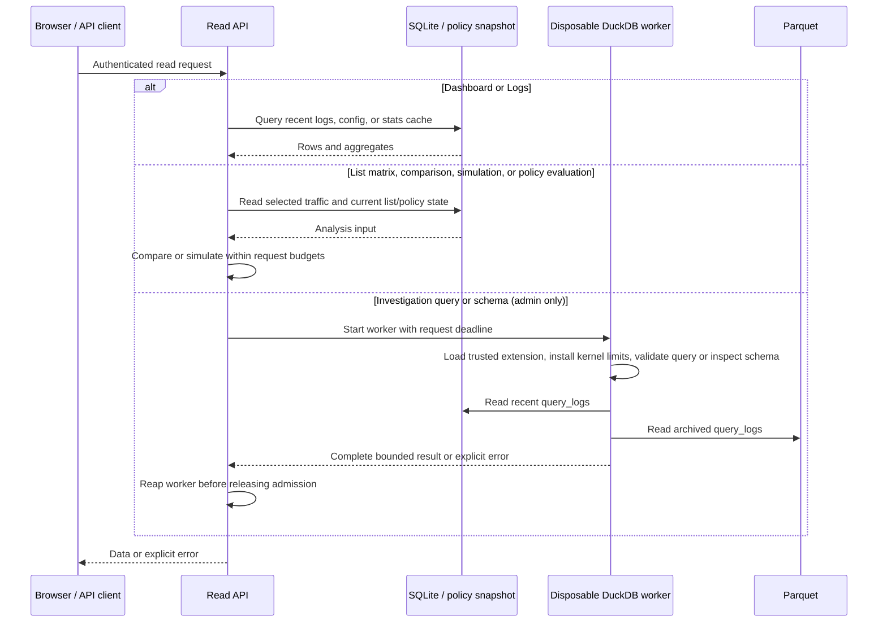
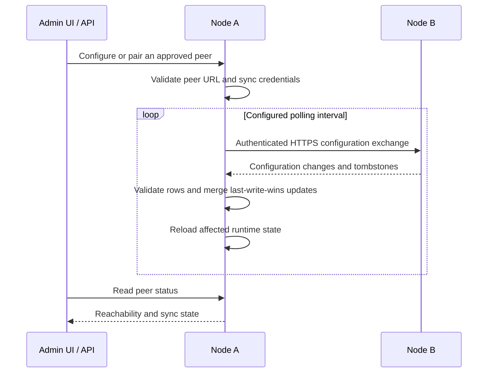

# Architecture

Svart runs one Go process with a UDP/TCP DNS listener and an HTTP(S) listener for
its embedded React UI, API, health endpoint, and metrics. SQLite and DuckDB are
embedded libraries. No external database or monitoring service is required to
answer DNS queries.



Upstream DNS, configured list hosts, and optional peers/Loki are external network
connections. The UI and API reference assets are served locally. DoH/DoT appear
on the upstream side only; admin HTTPS does not provide encrypted client DNS.

## DNS query

The handler checks the client ACL, optional rate limiter, question shape, and
DNS class. Rewrites are checked before filtering. The policy evaluator uses an
immutable snapshot and a bounded decision cache; request-time policy and runtime
settings reads do not query SQLite.



This diagram covers the normal logged path. Some front-door rejections return
before query logging. `ANY` queries use an RFC 8482 minimal response. UDP replies
respect the client's size limit and set the truncation flag when TCP retry is
needed. Identical concurrent cache misses share an upstream resolution.

Policy evaluates ranges, groups, then client IPs; the narrowest tier with a
decision wins. Within a tier a block wins between entities, while allows take
precedence inside an individual entity. With no decision the query is allowed.
CNAME target filtering is skipped when the queried name has an explicit allow;
returned-address filtering and optional rebinding checks still run.

## Setup and authentication

```mermaid
sequenceDiagram
    participant O as Operator
    participant B as Browser
    participant A as Setup/auth API
    participant S as SQLite
    O->>O: Read first-run token from server log
    B->>A: GET /api/setup
    A-->>B: Setup status and address hints
    B->>A: POST token, username, password
    A->>A: Validate token and throttle failures
    A->>S: Create first administrator
    A-->>B: Session cookie; setup closes
    B->>A: Save chosen upstreams and baseline assignments
    A->>S: Persist through normal configuration APIs
    Note over B,A: Later logins use /api/auth/login; logout revokes the session
```

The token is available only while no administrator exists. Authentication uses
browser sessions or API tokens, with read/admin authorization on API operations.
Users, tokens, and session revocation are managed through Admin. Setup tokens,
passwords, and API credentials are not configuration-sync onboarding shortcuts.

## Configuration changes and list refresh

Filter Lists, Assignments, Rewrites, Config, and Admin use HTTP APIs. A write
validates the request and authorization, persists it, and reloads the affected
runtime state. Configuration import/export uses dedicated admin endpoints.

```mermaid
sequenceDiagram
    participant B as Browser / API client
    participant A as Admin API
    participant S as SQLite
    participant W as List worker
    participant H as List host
    participant P as Runtime snapshots
    B->>A: Authorized configuration write or refresh request
    A->>A: Validate input and permissions
    A->>S: Persist accepted change
    alt List content refresh
        A->>W: Request background refresh
        A-->>B: Refresh accepted
        W->>H: Fetch with URL checks and download limits
        H-->>W: List body
        W->>W: Parse all input; report unsupported syntax
        W->>S: Replace list content only after successful parsing
        W->>P: Rebuild list/policy snapshot
    else Settings, assignments, or rewrites
        A->>P: Reload affected runtime state
        A-->>B: Result or explicit error
    end
```

Scheduled refreshes use the same list-fetch path. Refresh completion and errors
are visible through list status/history and logs. Failed downloads, oversized
input, parse failures, and storage failures retain the prior list version.
Current rules, refresh metadata, history, and every changelog row commit in one
transaction. Checkpoint readers observe a complete generation; history IDs order
refreshes that share a timestamp. Supported syntax is
not full AdGuard compatibility: see [Known limitations](../README.md#known-limitations).

## Dashboard, logs, analysis, and investigation



Dashboard sections refresh independently; the live query log has its own poll.
Analysis evaluates the traffic and lists available on the current node. It does
not observe queries sent to other resolvers. Investigation exposes `query_logs`
through a restricted SQL interface, not arbitrary filesystem or database access.
Schema discovery uses the same disposable worker and 30-second deadline as its
archive metadata budget. It returns native column names/types from the complete
live-plus-archive view. Both operations verify every ready archive before and
after reading it. Go SQLite catalog connections close before the worker's
DuckDB scanner starts, and that engine closes before the final catalog read;
separately embedded SQLite implementations must never share live WAL/SHM inside
one process. Worker cancellation kills and reaps the child before the archive
ownership lock is released. Schema resource failures retain the private HTTP 500
schema error; archive unavailability and cancellation retain HTTP 503.

Archive discovery reads Parquet schemas sequentially and groups files with the
same physical schema. Each group uses an explicit, escaped file list with lazy
native binding; groups are combined by column name to preserve older layouts.
This avoids eagerly retaining metadata for every archive at once. No file or row
is omitted to meet the worker's memory budget; a resource or integrity failure
returns an explicit error. Mixed schemas, reordered fields and literal wildcard
characters in filenames retain their original meaning.

If DuckDB initialization fails, the error is logged and DNS continues while
Investigation is unavailable.

## Logging and storage lifecycle

DNS replies follow admission to a bounded in-memory queue. Background batches
commit original events to a durable SQLite journal, then write presentation
rows, the replay cursor and optional Loki outbox in one transaction. Storage
outages apply bounded backpressure; overload is rejected rather than silently
dropping an accepted event. Clean shutdown drains the queue. An abrupt crash
can lose the newest volatile events because replies do not wait for a disk
commit. See [logging durability](logging-durability.md).

High-rate loops are coalesced per client/domain pair, with thresholds of 25
blocked or 100 allowed queries per second. Summary rows preserve query counts
in `coalesced_count`; the UI and Investigation read these presentation rows.
The journal and separate [raw archives](raw-archives.md) retain each original
event's timestamp, latency and metadata under the configured retention policy.
Raw records are query metadata, not packet captures. Event counts and summary-row
counts answer different questions.

The archive worker moves logs older than eight days into Snappy-compressed
Parquet segments with an additive ownership manifest and exact source sidecars.
Bounded snapshots, durable publication and checked transactional retirement make
restart and late historical arrivals recoverable. DuckDB queries recent SQLite
rows and archives together only when ownership is complete; unresolved overlap
or missing expected files is unavailable. See [summary ownership](summary-archives.md). Archive
retention defaults to 1,095 days and is configurable; expired archive files are
deleted by retention cleanup. Configuration, the SQLite database and its spool,
and the archive directory all matter for recovery; see [Operations](operations.md).

## Peer management and synchronization



Every node owns its SQLite database and can serve DNS independently. Sync shares
configuration using natural keys and timestamp conflict resolution. Query logs,
response caches, and downloaded list contents do not replicate. Users and API
tokens remain node-local unless identity replication is explicitly enabled.
TLS, the peer allowlist, and sync authentication are required; per-node mutual
TLS is a proposal in the decision records, not an implemented guarantee.

Health and Prometheus scraping are read-only HTTP endpoints. Optional Loki export
ships operational logs. These integrations do not participate in DNS resolution.
For deployment, TLS, backups, peer setup, and monitoring, use
[Operations](operations.md) and [Configuration](configuration.md).
